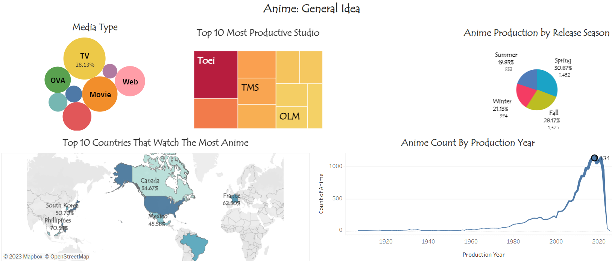

`🧶 Active`
# Anime Quest
[Anime](https://en.wikipedia.org/wiki/Anime) is a distinct type of animation that features distinctive storytelling, 
creative sensibilities, and cultural allegiances, making it a well-liked and significant form of entertainment all 
around the world. It was created in Japan and has since spread throughout the world.

**What Is `Anime Quest`, though? 🤔**

It’s a treasure of the anime world 🪙... Just kidding 😂… 

This public project is called Anime Quest, which used the [Selenium Python](https://selenium-python.readthedocs.io/) 
to extract anime information from the [Anime Planet](https://anime-planet.com/) website. After processing the dataset,
[Tableau Public](https://public.tableau.com/app/discover) is used to produce visualizations.

## Other Parts of the Project
1. Tableau Public Dashboard: [Anime Quest: Visualization](https://public.tableau.com/views/AnimeQuestVisualization/AnimeGeneralIdea?:language=en-US&:display_count=n&:origin=viz_share_link)
2. Scrapped Dataset: [Anime Quest Dataset](https://www.kaggle.com/datasets/myte21/anime-quest-an-epic-adventure-through-anime-data)

## Project Goal
Giving the project a data analysis tag will help us classify it more broadly. But after breaking down the wider concept, we can extract the project's goal, which is as follows:

1. [Scraping](https://en.wikipedia.org/wiki/Web_scraping) a [dynamic website](https://en.wikipedia.org/wiki/Dynamic_web_page) to extract details about anime.
2. Improve the extracted data's usability by processing it. a.k.a. **Data Processing**.
3. Use [Tableau Public](https://public.tableau.com/app/discover) to visualize the dataset to obtain valuable anime-related information.

***Other aspect of the project:***

1. **Exploratory Data Analysis**: Analyzing the data thoroughly and utilizing visual means to learn various data characteristics.
2. **Automatic testing** of the scraper files.

## Findings and Observations
Our investigations and observations can be divided Into `3` *distinct categories*. 
The tableau, [Anime Quest: Visualization](https://public.tableau.com/views/AnimeQuestVisualization/AnimeGeneralIdea?:language=en-US&:display_count=n&:origin=viz_share_link), 
contains a visualization of those results. Here, we list our findings in bullet points for discussion. Let's get started.

### Anime: General Idea



[🎴 **Visualization Link**](https://public.tableau.com/app/profile/myte/viz/AnimeQuestVisualization/AnimeGeneralIdea)

1. The most common form of media for anime production is `TV`.
2. The most successful anime production company is `Toei Animation`.
3. `Spring` season marks the release of more than 30% of anime, with `Fall` coming in slightly behind.
4. The top 3 countries where anime is watched the most are `Japan`, `the US`, and `the Philippines`.
5. Production of anime drastically rose after the year 2000 and `peaked in 2018`. The second and third most productive years for anime production are, respectively, 2017 and 2021.

### Anime: Top-Notch
1. `Sazae-san` has 2,706 episodes total, which is the most ever cast.
2. The most popular anime series are `Naruto`, `Attach on Titan`, and `Fullmetal Alchemist: Brotherhood`.
3. The majority of the top 15 TV anime fall under the area of `Action`.

### Anime: Global View
1. Considering the top 5 anime creators, we can find that the top genre of their writing is `Adventure`. There is also `Action` and `Mystery`.
2. The most popular genres of anime overall are `Action`, `Comedy`, `Drama`, and `Adventure`.
3. Most of the anime-watching countries watch `Naruto` and `Pokemon`.

## Resources and Websites
1. `Anime details` are collected using scraping from the [Anime Planet](https://www.anime-planet.com/) website.
2. Information about `anime countries` is gathered from the [Every Country's Favourite Anime](https://e.infogram.com/f2bfaed8-7046-43e6-aa41-367848a326ef?parent_url=https%3A%2F%2Fwww.broadbandchoices.co.uk%2Ffeatures%2Fevery-countrys-favourite-anime&src=embed#) website.
3. Data of `countries that watch the most anime` are collected using scraping from the [List of Countries that Watch the Most Anime](https://skdesu.com/en/list-of-countries-that-watch-the-most-anime/) website.

## Build-Run and Recreate Results
1. Clone the project:
    ```powershell
    git clone https://github.com/MYTE21/Anime.Planet.git
    ```
2. Initialize and activate virtual environment:
    ```powershell
   py -m venv venv
   venv/Scripts/Activate.ps1
    ```
3. Install dependencies:
    ```powershell
   pip install -r requirements.txt
    ```
4. Download [ChromeDriver](https://chromedriver.chromium.org/downloads)
5. Run the scraper:
    ```powershell
   python scraper/anime_scraper.py
   python scraper/anime_watching_scraper.py
    ```
## Contributors
**Project Owner**

|  | Md Yasmi Tohabar | [www.linkedin.com/in/myte/](https://www.linkedin.com/in/myte/) |
|-------------------------------------------------------------|------------------|----------------------------------------------------------------|

## License

The [Anime Quest](https://github.com/MYTE21/IC.Photography.Styles) project is released under the [MIT License](https://github.com/MYTE21/Anime.Quest/blob/main/LICENSE).
Feel free to use, modify, and distribute the project in accordance with the license terms.

## Contact

For any inquiries or questions regarding the [Anime Quest](https://github.com/MYTE21/IC.Photography.Styles) project,
please contact at [yasmi.tohabar@gmail.com](mailto:yasmi.tohabar@gmail.com).
We appreciate your interest and feedback.